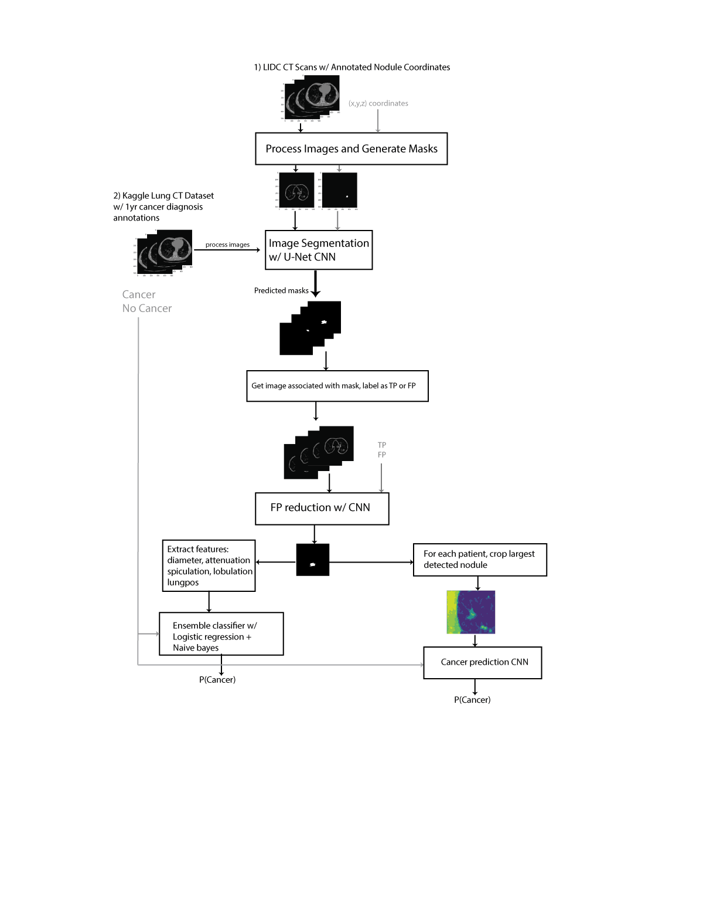

# Automated Detection and Classification of Nodules in Lung CT scans
## Description
Lung cancer is the second most common cancer in both men and women that afflicts 225,500 people a year in the United States. Nearly 1 out of 4 cancer deaths are from lung cancer, more than colon, breast, and prostate cancers combined. Early detection of the cancer can allow for early treatment which significantly increases the chances of survival. 
This project creates an algorithm that automatically detects candidate nodules and predicts the probability that the lung will be diagnosed with cancer within 1 year of the CT scans.
The algorithm is summarized by the following framework:

## Installation
### Required packages
* anaconda3
* Python 3.4
* Tensorflow
* Keras
* dicom, `$sudo pip install dicom`
* cell_magic_wand.py, included and is required to be in place of root directory with the notebooks https://github.com/NoahApthorpe/CellMagicWand
* h5py `$sudo pip install h5py`

### Required Data
**LIDC-IDRI dataset**
https://wiki.cancerimagingarchive.net/display/Public/LIDC-IDRI
* Images (DICOM, 124GB)
* DICOM Metadata Digest (CSV)
* Nodule Size List http://www.via.cornell.edu/lidc/list3.2.csv

**Kaggle Data Science Bowl 2017 Dataset** https://www.kaggle.com/c/data-science-bowl-2017/data
* stage1.7z (DICOM, 67GB)
* stage1_labels.csv.zip
* stage1_solution.csv.zip
* data_password.txt.zip

## The pipeline
1.	**1ProcessNoduleDataset.ipynb**
    * **Inputs:** LIDC dataset (DOI folder), list3_2.csv, LIDC-IDRI_MetaData.csv
	* **Outputs:** noduleimages.npy, nodulemasks.npy
2.	**2TrainUnet.ipynb**
	* **Inputs:** noduleimages.npy, nodulemasks.npy
	* **Outputs:** unet-weights-improvement.hdf5
3.	**3ClassifyNodulesLIDC.ipynb**
	* **Inputs:** LIDC dataset (DOI folder), list3_2.csv, LIDC-IDRI_MetaData.csv, unet-weights-improvement.hdf5
	* **Outputs:** truenodule-cnn-weights-improvement.hdf5
4.	**4DetectNodules.ipynb**
	* **Inputs:** unet-weights-improvement.hdf5, truenodule-cnn-weights-improvement.hdf5, Kaggle DSB2017 dataset (stage1 folder)
	* **Outputs:** DSBNoduleImages\*.npy, DSBNoduleMasks\*.npy, DSBPatientNoduleIndex\*.csv 
5.	**5CancerPredictionClassifiers.ipynb**
	* **Inputs:** DSBPatientNoduleIndex*.csv
6.	**6CancerPredictionCNN.ipynb**
	* **Inputs:** DSBNoduleImages*.npy, DSBNoduleMasks*.npy, DSBPatientNoduleIndex*.csv

\*Split into a series of files due to large memory requirements

## About

Mike Huang, huangjmike@gmail.com